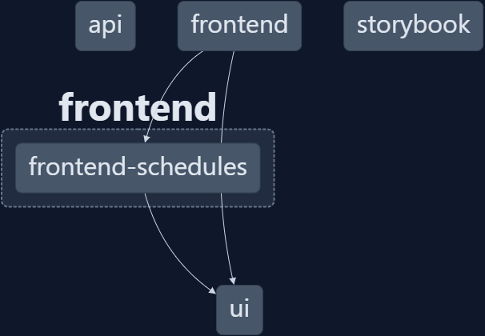

# ◭ Blue Prism UI Tech Test ◭

Table of Contents:

- [◭ Blue Prism UI Tech Test ◭](#-blue-prism-ui-tech-test-)
  - [Overview](#overview)
    - [Built With](#built-with)
  - [Pre-requisites](#pre-requisites)
  - [Getting started](#getting-started)
  - [Storybook](#storybook)
    - [Running storybook](#running-storybook)
  - [Usage](#usage)
  - [Repository Structure](#repository-structure)
    - [NX Dependency graph](#nx-dependency-graph)
  - [Known Issues / Future improvements](#known-issues--future-improvements)

## Overview

This is a simple application that allows a user to view a list of schedules and their logs. This tries to implement the [Blue Prism UI Tech Test](docs/bp-ui-tech-test.md) requirements.

### Built With

- 
- 
- 
- 
- 
- 
- 
- [react-aria](https://react-spectrum.adobe.com/react-aria/)/[react-aria-components](https://react-spectrum.adobe.com/react-aria/react-aria-components.html) - library of React Hooks/components that provides accessible UI

## Pre-requisites

- Install [Node.js](https://nodejs.org/en/download) version 18

## Getting started

- Clone this repository
  
  ```bash
  git clone https://github.com/JR1b/schedules.git
  ```

- Install dependencies

  ```bash
  cd schedules
  pnpm install
  ```

- Run the app

  ```bash
   pnpm nx run-many --target=serve --projects=api,frontend --parallel
  ```

- Navigate to `http://localhost:4200`

## Storybook

[Autodocs](https://storybook.js.org/docs/7.0/react/writing-docs/autodocs) was used to show component descriptions as documentation in storybook.

### Running storybook

- Run storybook

  ```bash
  pnpm nx storybook ui
  ```

- Navigate to `http://localhost:4401`

Note: There was an attempt to create a storybook for all the libraries using [storybook composition](https://nx.dev/packages/storybook/documents/storybook-composition-setup). However, it seems that the storybook composition is not yet stable and not yet working as expected, maybe a miss configuration or some other issue. So only storybook for the ui library is available.

## Usage

Please refer to the [Documentation](docs/use-cases.md).

## Repository Structure

```bash
schedules
├── apps
│   ├── api
│   └── frontend
├── docs
└── libs
    ├── frontend
    │  └── schedules
    └── ui
```

### NX Dependency graph



- Run it for yourself:

  ```bash
  pnpm nx graph
  ```

- navigate to `http://127.0.0.1:4211/projects/all`

## Known Issues / Future improvements

- [ ] Log filter state should not be scoped to the selected schedule
- [ ] Add a way to reset the log filter
- [ ] Allow to also filter schedule
- [ ] Allow to filter schedules and logs by dates
- [ ] Fix having to scroll the window for landscape mobile view, on screen that are not tall enough
      *Note: This can probably be done by adding a [custom media queries](https://tailwindcss.com/docs/screens#custom-media-queries) in tailwind*
- [ ] Storybook composition is not yet stable
- [ ] Storybook for all libraries(not just ui)
- [ ] tests for all libraries
- [ ] e2e tests
- [ ] live demo, not importing mock data and some css issues
