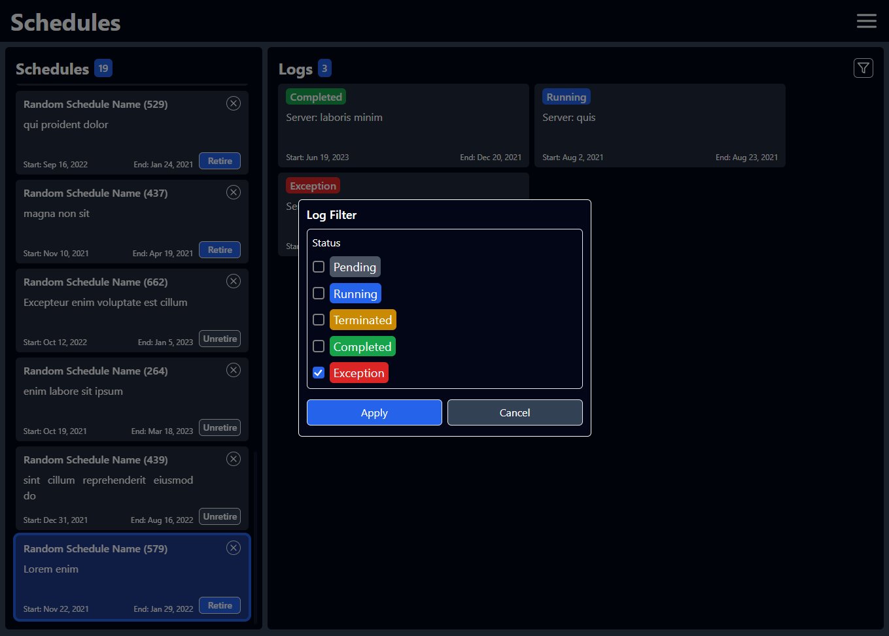

# Use cases

* As a user I initially get presented with a list of the available schedules
 
  
* As a user I can view a schedule corresponding log entries by selecting its card.
  

* As a user I can switch a schedule to retired/unretired.
  * Retire:
  
  * Unretire:
  

* A user can filter the list of logs by status for the selected schedule.
  By clicking the filter button, at the top right of the logs list, a modal will appear where the user can choose the status to filter.
  * Before applying filter, choosing only the `exception` status:
  
  * After applying filter, choosing only the `exception` status:
  

* A user can use the application on a variety of devices.
  * Desktop:
  
      

  * Wide screens:
  
      

  * Tablet:
  
      

  * Mobile (portrait):

      

  * Mobile (landscape):
  
      
  